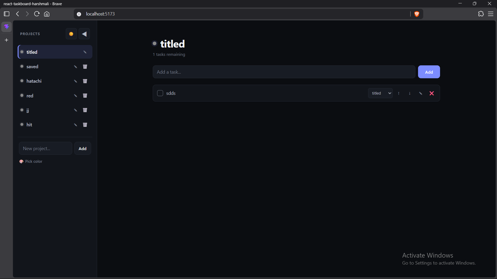
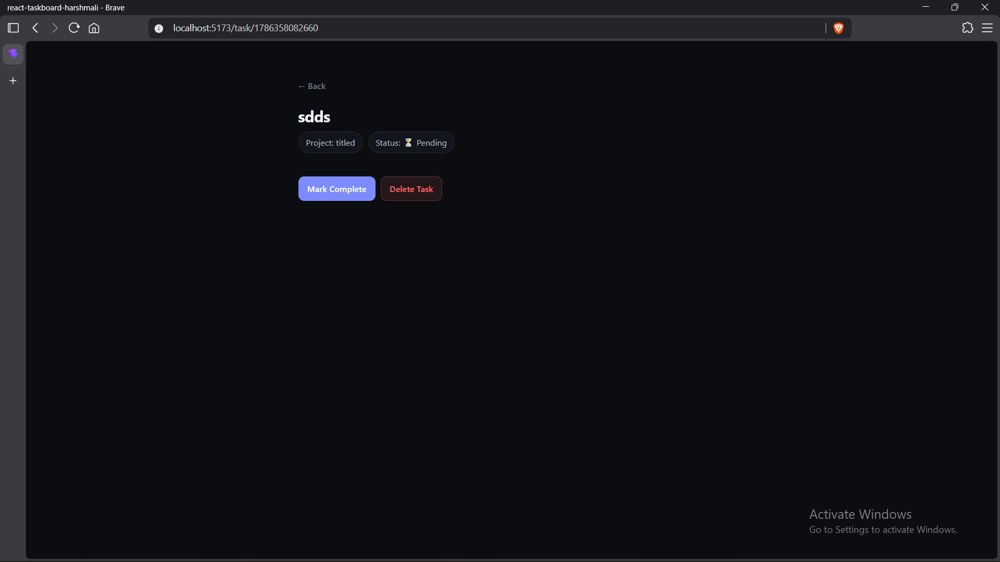
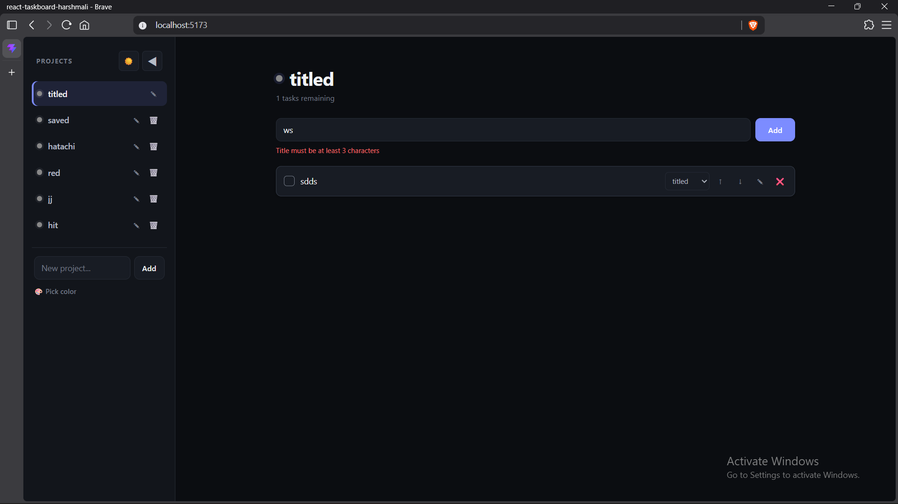
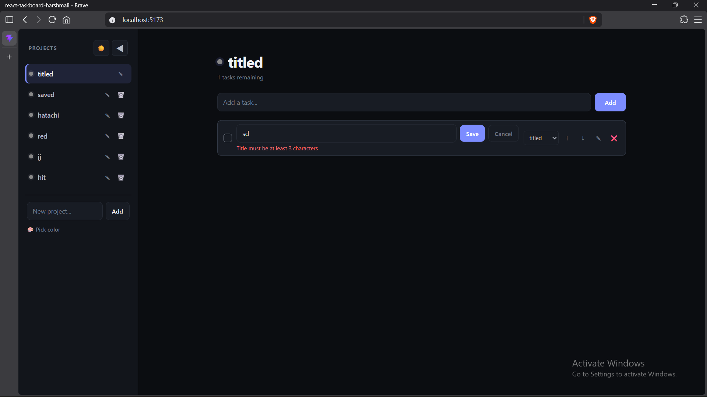

# React Task Board

A lightweight, responsive task management single-page application built for the WeVerve Systems Engineering Internship Program. 

## Setup Instructions

To run this project locally, ensure you have Node.js installed, then run the following commands in your terminal:

```bash
# Clone the repository
git clone https://github.com/HasbroGardener21/react-taskboard-harshmali.git

# Navigate into the project directory
cd react-taskboard-harshmali

# Install dependencies
npm install

# Start the development server
npm run dev
```

Open <http://localhost:5173> to view it in the browser.

Approach & Architecture
--------------------------

My goal was to build a clean, maintainable, and highly responsive React application utilizing modern hooks and functional components.

-   **State Management**: I utilized the Context API (`AppContext.jsx`) to manage global state for tasks, projects, and the application theme. This prevented prop-drilling across the nested component tree and kept the logic centralized and clean.

-   **Routing**: Implemented client-side routing using `react-router-dom` (v7) to handle seamless navigation between the main Task Board and individual Task Details views.

-   **Data Persistence**: All tasks, projects, color codes, and user preferences (like dark/light theme) are continuously synced to the browser's `localStorage`. This acts as a reliable single source of truth across page reloads.

-   **API Integration**: On the initial load, the app fetches seed data from `JSONPlaceholder`, maps the titles to the default "Inbox" project, and flags the `localStorage` so the fetch doesn't overwrite user data on subsequent visits.

-   **Styling**: I chose to use vanilla CSS with CSS Variables (Custom Properties) to handle styling and theming. This allowed for a highly responsive mobile layout and an effortless Dark/Light mode toggle without the overhead of heavy UI libraries.

Screenshots
--------------

**Desktop View (Dark Mode)**



**Mobile View & Collapsed Sidebar (Light Mode)**


**Task Details & Form Validation**




Known Limitations
--------------------

-   **Task Reordering**: Task reordering is currently implemented via explicit "Up" and "Down" action buttons rather than drag-and-drop. This ensures fully accessible keyboard navigation and state persistence while meeting the core requirements.

-   **Backend**: There is no actual database backend; all data relies strictly on client-side `localStorage`. Clearing browser data will reset the application.